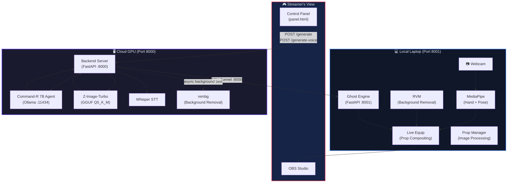
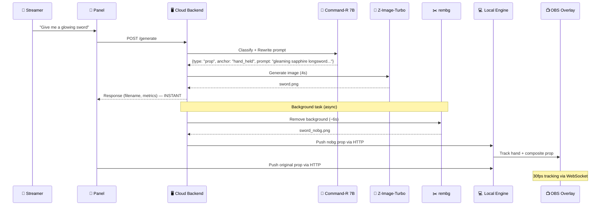
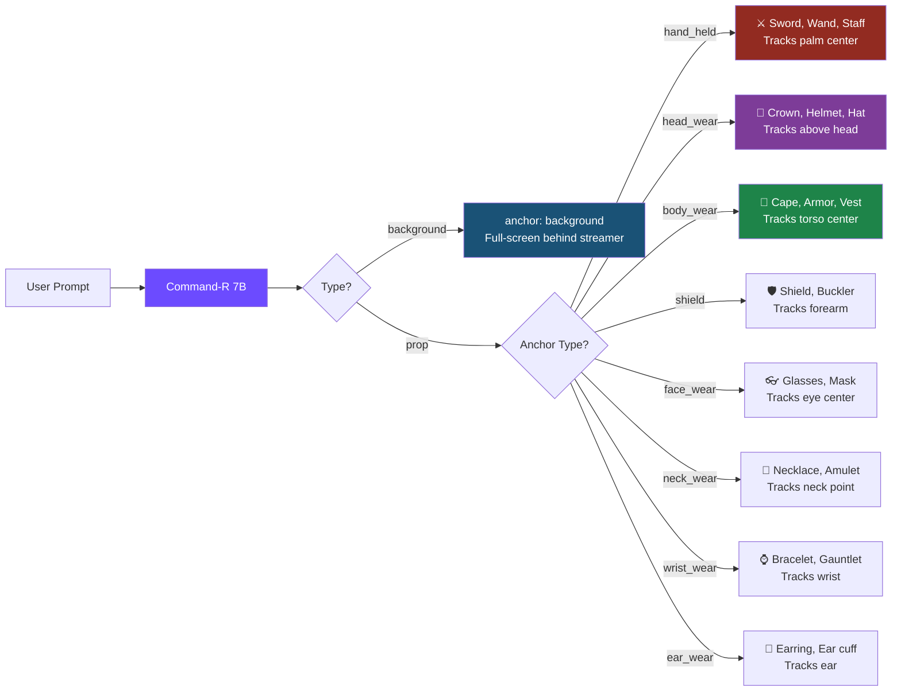

# Ghost Frame — Project Architecture

## System Overview

Ghost Frame is a **real-time AI prop & background system** for livestreamers. A streamer speaks or types a prompt → an AI agent classifies it → an image is generated → it appears on their stream, tracked to their body in real-time.



---

## Data Flow Pipeline



---

## Two-Machine Architecture

```
┌─────────────────────────────────────────────┐
│              CLOUD GPU (gpu26)              │
│         ssh gpu26@10.214.4.236 -p 22013     │
│                                             │
│  ┌─────────────────────────────────────┐    │
│  │     FastAPI Backend (:8000)         │    │
│  │                                     │    │
│  │  /generate      → Agent + Z-Image  │    │
│  │  /generate-voice → Whisper + Above  │    │
│  │  /upload-prop    → Custom prop      │    │
│  │  /clear-props    → Reset overlay    │    │
│  │  /health         → Health check     │    │
│  │  /heartbeat      → Keepalive        │    │
│  │  /ws/anchor      → WebSocket events │    │
│  │  /outputs/*      → Generated images │    │
│  │  /app/*          → Frontend files   │    │
│  └──────────┬──────────────────────────┘    │
│             │                               │
│  ┌──────────┴──────────┐  ┌──────────────┐  │
│  │  Z-Image-Turbo      │  │  Ollama      │  │
│  │  (Diffusion GGUF)   │  │  (:11434)    │  │
│  │  ~10GB VRAM         │  │  Command-R7B │  │
│  │  4-bit quantized    │  │  ~3.4GB VRAM │  │
│  └─────────────────────┘  └──────────────┘  │
│                                             │
│  Total VRAM: ~14GB / 16GB                   │
└──────────────────┬──────────────────────────┘
                   │
          SSH Tunnel (-L 8000:localhost:8000)
                   │
┌──────────────────┴──────────────────────────┐
│           LOCAL LAPTOP (RTX 5050)            │
│                                             │
│  ┌─────────────────────────────────────┐    │
│  │     Ghost Engine (:8001)            │    │
│  │                                     │    │
│  │  /equip          → Load new prop    │    │
│  │  /equip-background → Load new BG   │    │
│  │  /health         → FPS + status     │    │
│  │  /ws/anchor      → 30fps tracking   │    │
│  └──────────┬──────────────────────────┘    │
│             │                               │
│  ┌──────────┴──────────────────────────┐    │
│  │  Prop Compositing Pipeline          │    │
│  │                                     │    │
│  │  📷 Webcam → MediaPipe Tracking     │    │
│  │      ├─ Hand Landmarks (21 pts)     │    │
│  │      └─ Pose Landmarks (33 pts)     │    │
│  │          ↓                          │    │
│  │  🎯 Anchor Detection               │    │
│  │      ├─ hand_held  (palm center)    │    │
│  │      ├─ head_wear  (above head)     │    │
│  │      ├─ body_wear  (torso center)   │    │
│  │      ├─ shield     (forearm)        │    │
│  │      ├─ neck_wear  (neck point)     │    │
│  │      ├─ wrist_wear (wrist)          │    │
│  │      ├─ ear_wear   (ear)            │    │
│  │      └─ face_wear  (eye center)     │    │
│  │          ↓                          │    │
│  │  🖼️ Compositing (30fps)            │    │
│  │      ├─ Scale (body-proportional)   │    │
│  │      ├─ Rotation (hand/head angle)  │    │
│  │      ├─ Flip (left/right hand)      │    │
│  │      └─ Alpha blending (antialiased)│    │
│  │          ↓                          │    │
│  │  🎬 RVM Background Removal         │    │
│  │      └─ Real-time matting           │    │
│  └─────────────────────────────────────┘    │
│                                             │
│  ┌─────────────────────────────────────┐    │
│  │  OBS Integration                    │    │
│  │                                     │    │
│  │  Layer 1: Window Capture            │    │
│  │           (Prop Engine window)      │    │
│  │                                     │    │
│  │  Layer 2: Browser Source            │    │
│  │           overlay.html (transparent)│    │
│  │           WebSocket tracking @30fps │    │
│  └─────────────────────────────────────┘    │
│                                             │
│  Browser (NOT on stream):                   │
│  └─ panel.html — Voice/Text control panel   │
└─────────────────────────────────────────────┘
```

---

## File Structure

```
Ghost Frame/
├── START_HERE.md                    ← 📖 Quickstart guide
├── config.py                        ← ⚙️ Global configuration
│
├── backend/                         ← 🖥️ Cloud GPU server
│   ├── main.py                      ← FastAPI app (all endpoints)
│   ├── setup.sh                     ← One-time GPU setup script
│   ├── requirements.txt             ← Python dependencies
│   │
│   ├── engine/
│   │   └── zimage_turbo.py          ← Image generation (GGUF diffusion)
│   │
│   ├── agent/
│   │   ├── client.py                ← Ollama API client (Command-R 7B)
│   │   ├── router.py                ← Agent orchestration + fallback
│   │   ├── rewriter.py              ← Prompt enhancement
│   │   └── safety.py                ← Content safety filter
│   │
│   ├── stt/
│   │   └── transcriber.py           ← Whisper speech-to-text
│   │
│   └── models/gguf/
│       └── z_image_turbo-Q5_K_M.gguf  ← (~5GB, downloaded by setup.sh)
│
├── frontend/                        ← 🌐 Web UI (served at /app/)
│   ├── index.html + script.js + style.css  ← Dashboard
│   ├── panel.html                   ← Streamer control panel
│   ├── overlay.html + overlay.js    ← OBS transparent overlay
│
└── local_engine/                    ← 💻 Laptop-side engine
    ├── ghost_engine.py              ← FastAPI app (:8001)
    ├── live_equip.py                ← Prop compositing pipeline
    ├── prop_config.py               ← Attachment profiles & scaling
    ├── prop_manager.py              ← Image loading & preprocessing
    ├── tracker.py                   ← MediaPipe hand + pose tracking
    ├── background_remover.py        ← RVM real-time matting
    └── *.task / *.pth               ← MediaPipe & RVM model weights
```

---

## Agent Classification Flow



---

## Performance Budget

| Component | Resource | Usage |
|-----------|----------|-------|
| Z-Image-Turbo | GPU VRAM | ~10.3 GB |
| Command-R 7B | GPU VRAM | ~3.4 GB |
| **Total GPU VRAM** | | **~14 GB / 16 GB** |
| Image Generation | Latency | ~4.2s |
| Agent Classification | Latency | ~1-2s |
| rembg (async) | Latency | ~6s (non-blocking) |
| **Total Perceived** | | **~6s** |
| Local Engine | FPS | 30 fps |
| Tracking (MediaPipe) | CPU | ~15% |
| RVM Matting | GPU (laptop) | ~2 GB |
